# OpenSource-Contribution-Card

[](https://opensource.org/licenses/MIT)

GitHub 프로필 README에 **외부 오픈소스 기여 내역**을 자동으로 표시하는 위젯입니다.

자신의 레포가 아닌, 다른 프로젝트에 **merge된 PR**만 표시합니다.

## Preview

| Light | Dark |
|-------|------|
|  |  |

## Features

- **외부 기여만 표시** - 자신의 레포 제외, 다른 프로젝트에 merge된 PR만
- **자동 업데이트** - GitHub Actions로 매일 자동 갱신
- **Keepalive 보호** - 60일간 활동이 없어도 스케줄 워크플로우가 자동 비활성화되지 않도록 방지
- **5가지 테마** - `light`, `dark`, `nord`, `dracula`, `tokyo`
- **자동 테마 감지** - GitHub 라이트/다크 모드에 따라 자동 색상 전환
- **PR 번호 표시** - 각 카드에 PR 번호 표시 (예: #1492)
- **정렬 옵션** - 날짜순 또는 PR 수 기준 정렬
- **날짜 필터** - 최근 N개월 기여만 표시 가능
- **org 필터** - 특정 organization만 포함하거나 제외 가능
- **OSS Score** - 오픈소스 기여도를 점수로 표시
- **기여 유형 자동 분류** - PR 라벨 기반으로 Bug Fix, Feature, Docs 등 자동 표시
- **레포지토리 아이콘** - 각 카드에 레포 오너의 아바타 표시
- **Featured PRs** - 노출할 PR을 수동으로 선택 가능

---

## Quick Start

### Step 1: 파일 복사

자신의 프로필 레포지토리 (`username/username`)에 다음 파일들을 복사합니다:

```
your-username/
├── .github/
│   └── workflows/
│       └── update-contributions.yml
├── src/
│   ├── index.js
│   ├── fetch-contributions.js
│   └── generate-svg.js
├── package.json
└── README.md (프로필 README)
```

### Step 2: Actions 권한 설정

레포지토리 **Settings** → **Actions** → **General**:

1. **Workflow permissions** 섹션에서
2. **"Read and write permissions"** 선택
3. **Save** 클릭

### Step 3: README에 이미지 추가

프로필 `README.md`에 다음을 추가:

```markdown
## Open Source Contributions


```

### Step 4: 실행

**자동 실행:** 하루 3번 자동 업데이트 (한국시간 09:00, 17:00, 01:00)

**수동 실행:**
1. **Actions** 탭 → **Update Contributions SVG**
2. **Run workflow** 클릭

---

## Configuration

레포지토리 **Settings** → **Secrets and variables** → **Actions** → **Variables** 탭에서 설정:

| Variable | Description | Default |
|----------|-------------|---------|
| `THEME` | 테마 (`light`, `dark`, `nord`, `dracula`, `tokyo`) | `light` |
| `AUTO_THEME` | GitHub 테마 자동 감지 (`true`/`false`) | `false` |
| `MAX_REPOS` | 표시할 최대 PR 수 (1-10) | `6` |
| `TITLE` | 커스텀 타이틀 | `Open-Source Contributions` |
| `SORT_BY` | 정렬 기준 (`date`: 최신순, `count`: PR 많은 순) | `date` |
| `MONTHS_AGO` | 최근 N개월만 표시 (예: `6`) | 전체 |
| `EXCLUDE_ORGS` | 제외할 org/user (쉼표 구분) | - |
| `INCLUDE_ORGS` | 포함할 org/user만 표시 (쉼표 구분) | 전체 |
| `FEATURED_PRS_PATH` | Featured PRs 설정 파일 경로 | `./featured-prs.json` |
| `LOCALE` | 날짜 표시 로케일 (BCP 47, 예: `ko-KR`, `ja-JP`) | `en-US` |
| `WIDTH` | SVG 너비 (픽셀, 최소 `400`, 그 미만이면 자동 clamp) | `480` |
| `HIDE_TITLE` | 헤더(타이틀/통계/점수 배지) 숨김 | `false` |
| `HIDE_BORDER` | 카드 테두리 선 숨김 | `false` |

### 설정 예시

**자동 테마 감지 (권장):**

GitHub 라이트/다크 모드에 따라 자동으로 색상이 전환됩니다:

1. **Settings** → **Secrets and variables** → **Actions** → **Variables**
2. **New repository variable** 클릭
3. Name: `AUTO_THEME`, Value: `true`

> 💡 `AUTO_THEME=true`를 사용하면 `THEME` 설정은 무시됩니다.

**다크 테마 + 최근 6개월만 표시:**

1. **Settings** → **Secrets and variables** → **Actions** → **Variables**
2. **New repository variable** 클릭
3. 다음 변수들 추가:
   - Name: `THEME`, Value: `dark`
   - Name: `MONTHS_AGO`, Value: `6`

**특정 org/user 필터링:**

특정 organization만 표시하거나 제외할 수 있습니다:

- `INCLUDE_ORGS`: `ros2,kubernetes` → ros2, kubernetes org의 PR만 표시
- `EXCLUDE_ORGS`: `my-company` → my-company org의 PR 제외

> 💡 `INCLUDE_ORGS`가 설정되면 해당 org만 표시되고, `EXCLUDE_ORGS`는 무시됩니다.

---

## Themes

### Light (기본값)


### Dark


### Nord


### Dracula


### Tokyo Night


---

## OSS Score

카드 우측 상단에 표시되는 **OSS Score**는 오픈소스 기여도를 수치화한 점수입니다.

### 계산 방식

```
OSS Score = (총 Merge된 PR 수 × 10) + (기여한 레포 수 × 20)
```

| 항목 | 점수 |
|------|------|
| Merge된 PR 1개당 | +10점 |
| 기여한 레포 1개당 | +20점 |

### 예시

- 3개 레포에 5개 PR merge → `(5 × 10) + (3 × 20)` = **110점**
- 1개 레포에 10개 PR merge → `(10 × 10) + (1 × 20)` = **120점**

> 다양한 프로젝트에 기여할수록, 그리고 더 많은 PR이 merge될수록 점수가 올라갑니다.

---

## 기여 유형 (Contribution Type)

각 PR 카드에는 라벨 기반으로 기여 유형이 자동 표시됩니다.

| 유형 | 인식되는 라벨 |
|------|--------------|
| Bug Fix | `bug`, `fix` |
| Feature | `feat`, `enhancement` |
| Docs | `doc`, `documentation` |
| Tests | `test` |
| Refactor | `refactor` |
| Merged | (라벨 없음 또는 기타) |

---

## Featured PRs (수동 선택)

특정 PR만 카드에 노출하고 싶을 때 사용합니다.

### 설정 방법

프로젝트 루트에 `featured-prs.json` 파일 생성:

```json
[
  "facebook/react#12345",
  "kubernetes/kubernetes#67890"
]
```

형식: `"소유자/레포명#PR번호"`

### 동작

- 파일이 있으면 → 지정된 PR만 카드에 표시
- 파일이 없으면 → 기존처럼 자동 표시
- 헤더의 총 PR 수와 레포 수는 전체 기여 기준 유지

---

## Local Development

```bash
# 클론
git clone https://github.com/dbwls99706/OpenSource-contribution-card
cd OpenSource-contribution-card

# 실행 (실제 GitHub API 사용)
node src/index.js <your-username>

# 테마 변경
THEME=dark node src/index.js <your-username>

# 자동 테마 감지 (GitHub 라이트/다크 모드 자동 전환)
AUTO_THEME=true node src/index.js <your-username>

# 특정 org만 표시
INCLUDE_ORGS=ros2,kubernetes node src/index.js <your-username>

# 특정 org 제외
EXCLUDE_ORGS=my-company node src/index.js <your-username>

# 테스트 (Mock 데이터)
node src/index.js <your-username> --mock
```

---

## How It Works

```
GitHub Actions (매일 자동 실행)
         │
         ▼
┌─────────────────────────────────┐
│  1. GitHub Search API 호출      │
│     author:{user} type:pr       │
│     is:merged -user:{user}      │
└─────────────────────────────────┘
         │
         ▼
┌─────────────────────────────────┐
│  2. PR 데이터 정렬 및 필터링    │
└─────────────────────────────────┘
         │
         ▼
┌─────────────────────────────────┐
│  3. SVG 카드 생성               │
└─────────────────────────────────┘
         │
         ▼
┌─────────────────────────────────┐
│  4. contributions.svg 커밋      │
└─────────────────────────────────┘
```

---

## Limitations

- GitHub README에서 SVG 내부 링크는 보안상 비활성화됨
- PR 번호가 표시되므로 GitHub에서 직접 검색 가능

---

## Troubleshooting

### SVG가 생성되지 않아요
1. **Actions** 탭에서 워크플로우 실행 로그 확인
2. **Settings** → **Actions** → **General**에서 권한이 "Read and write"인지 확인

### 기여 내역이 안 보여요
- 자신의 레포가 아닌 **외부 프로젝트**에 merge된 PR만 표시됩니다
- PR이 실제로 merge되었는지 확인하세요

### 수동 실행 후 변경이 바로 안 보여요
- GitHub는 이미지를 캐싱하기 때문에 SVG 업데이트 후 **최대 5~10분** 정도 지연될 수 있습니다
- 강제 새로고침(Ctrl+Shift+R / Cmd+Shift+R)을 시도해보세요
- 그래도 안 되면 잠시 기다렸다가 다시 확인해주세요

### 60일 후 워크플로우가 자동 비활성화됐어요

GitHub는 60일간 활동이 없는 레포의 스케줄 워크플로우를 자동 비활성화합니다. 이 템플릿은 약 45일마다 빈 커밋을 생성하는 keepalive 스텝을 포함하여 이를 방지하지만, keepalive 추가 이전에 이미 비활성화되었다면:

1. 프로필 레포의 **Actions** 탭으로 이동
2. 왼쪽 사이드바에서 **Update Contributions SVG** 클릭
3. 페이지 상단의 **Enable workflow** 버튼 클릭
4. (선택) **Run workflow**를 눌러 즉시 실행

재발 방지를 위해, `.github/workflows/update-contributions.yml` 파일에 이 템플릿의 최신 `Keepalive workflow` 스텝이 포함되어 있는지 확인하세요.

---

## License

MIT

---

## Credits

Created by [@dbwls99706](https://github.com/dbwls99706)
